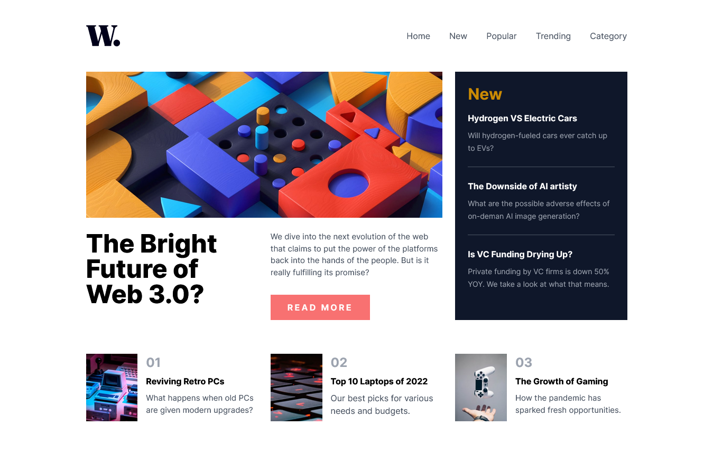

# Frontend Mentor - News homepage solution

This is a solution to the [News homepage challenge on Frontend Mentor](https://www.frontendmentor.io/challenges/news-homepage-H6SWTa1MFl). Frontend Mentor challenges help you improve your coding skills by building realistic projects.

## Table of contents

- [Overview](#overview)
  - [The challenge](#the-challenge)
  - [Screenshot](#screenshot)
  - [Links](#links)
- [My process](#my-process)
  - [Built with](#built-with)
- [Author](#author)

### Screenshot

### Links

- [Solution URL](https://www.frontendmentor.io/solutions/news-homepage-01He1sOfrn)
- [ALive Site URL](https://jbidz.github.io/news-homepage/)

## My process

### Built with

- Semantic HTML5 markup
- Flexbox
- CSS Grid
- [Tailwindcss](https://tailwindcss.com)

## Author

- Frontend Mentor - [@jbidz](https://www.frontendmentor.io/profile/jbidz)
- Twitter - [@BidongJohn](https://www.twitter.com/BidongJohn)
